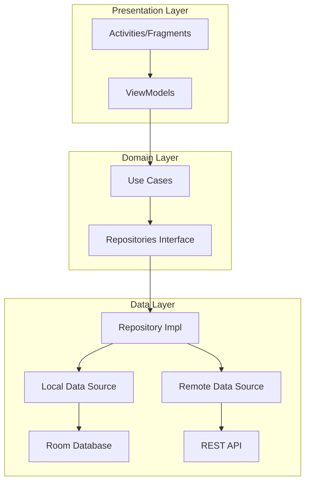
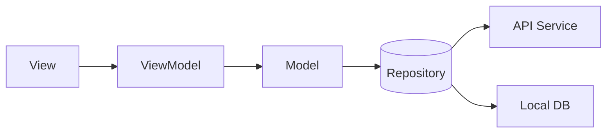

# CeKulit Mobile App

<div align="center">
  
  <p><i>AI-Powered Skin Analysis Mobile Application</i></p>

  [](https://github.com/CeKulit/cekulit-mobile/actions)
  [](https://github.com/CeKulit/cekulit-mobile/releases)
  [](https://android-arsenal.com/api?level=24)
  [](LICENSE)
</div>

## Contents
- [Overview](#overview)
- [Features](#features)
- [Architecture](#architecture)
- [Tech Stack](#tech-stack)
- [Project Setup](#project-setup)
- [Development Guide](#development-guide)
- [UI Components](#ui-components)
- [Testing](#testing)
- [Progress Reports](#progress-reports)
- [Contributors](#contributors)

## Overview

CeKulit is an innovative Android application that helps users identify their skin type using advanced AI technology. The app provides personalized skincare recommendations and tracking features to help users maintain healthy skin care routines.

### Problem Statement
According to WHO, over 900 million people globally are impacted by skin conditions, with limited access to dermatological care creating a significant barrier to treatment. CeKulit aims to bridge this gap by providing accessible skin analysis tools through mobile technology.

## Features

🔍 **Smart Skin Analysis**
- Real-time skin type detection
- High-accuracy AI-powered analysis
- Supports various lighting conditions

👤 **User Profile**
- Personalized skin care tracking
- Analysis history
- Progress monitoring

📱 **Intuitive Interface**
- Material Design 3 components
- Dark/Light theme support
- Responsive layouts

🔐 **Security**
- Secure user authentication
- Private data protection
- Encrypted local storage

## Architecture

### App Architecture


### MVVM Pattern


## Tech Stack

### Core Technologies
- **Language:** Kotlin
- **Minimum SDK:** 24 (Android 7.0)
- **Target SDK:** 34 (Android 14)

### Libraries & Dependencies
```gradle
dependencies {
    // Core Android
    implementation 'androidx.core:core-ktx:1.12.0'
    implementation 'androidx.appcompat:appcompat:1.6.1'
    implementation 'com.google.android.material:material:1.11.0'

    // Architecture Components
    implementation 'androidx.lifecycle:lifecycle-viewmodel-ktx:2.7.0'
    implementation 'androidx.lifecycle:lifecycle-livedata-ktx:2.7.0'
    implementation 'androidx.room:room-runtime:2.6.1'
    implementation 'androidx.navigation:navigation-fragment-ktx:2.7.7'

    // Network
    implementation 'com.squareup.retrofit2:retrofit:2.9.0'
    implementation 'com.squareup.okhttp3:okhttp:4.12.0'

    // Image Processing
    implementation 'androidx.camera:camera-camera2:1.3.1'
    implementation 'androidx.camera:camera-lifecycle:1.3.1'
    implementation 'com.github.bumptech.glide:glide:4.16.0'

    // DI
    implementation 'com.google.dagger:hilt-android:2.50'

    // Testing
    testImplementation 'junit:junit:4.13.2'
    androidTestImplementation 'androidx.test.ext:junit:1.1.5'
}
```

## Project Setup

### Prerequisites
- Android Studio Hedgehog (2023.1.1) or newer
- JDK 17
- Android SDK 34
- Gradle 8.2

### Installation
1. Clone the repository
```bash
git clone https://github.com/CeKulit/cekulit-mobile.git
```

2. Open project in Android Studio

3. Configure local properties
```properties
# local.properties
sdk.dir=/path/to/android/sdk
api.base.url=https://api.cekulit.app/v1/
```

4. Build the project
```bash
./gradlew build
```

## Development Guide

### Project Structure
```
app/
├── src/
│   ├── main/
│   │   ├── java/com/cekulit/
│   │   │   ├── data/
│   │   │   ├── di/
│   │   │   ├── domain/
│   │   │   ├── presentation/
│   │   │   └── utils/
│   │   └── res/
│   └── test/
├── build.gradle
└── proguard-rules.pro
```

### Coding Standards
- Follow [Kotlin Coding Conventions](https://kotlinlang.org/docs/coding-conventions.html)
- Use dependency injection with Hilt
- Implement clean architecture principles
- Write unit tests for business logic
- Document public APIs and complex implementations

## UI Components

### Screenshots
<div align="center">
  
  
  
  
</div>

### Material Design Implementation
- Custom theme following Material Design 3
- Dynamic color support
- Consistent typography and spacing
- Accessible UI elements

## Testing

### Unit Tests
```kotlin
@Test
fun `skin analysis should return valid result`() {
    // Test implementation
}
```

### UI Tests
```kotlin
@Test
fun captureImageAndAnalyze() {
    // UI test implementation
}
```

## Progress Reports

### Week 1: Project Setup and Initial Development ✅
- [x] Project structure setup
- [x] Basic navigation implementation
- [x] Camera integration

### Week 2: Core Feature Development ✅
- [x] API integration
- [x] User profile implementation
- [x] Local database setup

### Week 3: UI Enhancement and Testing 🚧
- [x] UI polish
- [x] Performance optimization
- [ ] Component testing

### Week 4: Final Testing and Deployment 📋
- [ ] User acceptance testing
- [ ] Bug fixes
- [ ] Play Store preparation

## Contributors

### Mobile Development Team
- **Alvano Hastagina** (Universitas Ibn Khaldun Bogor)
  - Feature Development
  - Testing Implementation
- **Viera Adella** (Universitas Riau)
  - UI/UX Implementation

### Technical Advisors
- Nurrahman Hadi
- Candra Reza Prasetya Gannes

## License
This project is licensed under the MIT License - see the [LICENSE](LICENSE) file for details.

## Acknowledgments
- WHO for global skin health statistics
- Our university partners for resources and support
- The open-source community for amazing libraries

---

<div align="center">
  <p>Made with ❤️ by CeKulit Team</p>
  <p>© 2024 CeKulit. All rights reserved.</p>
</div>
